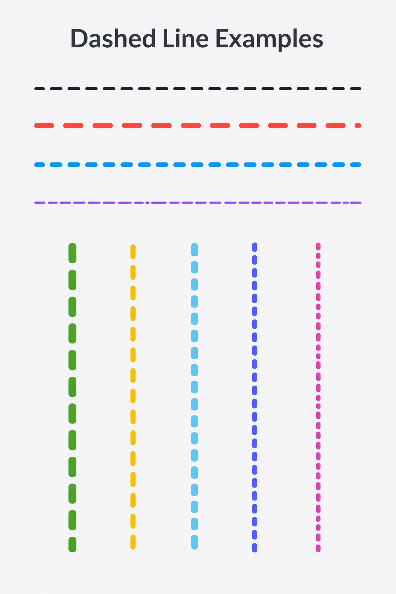

## DashLinePainter
[](https://kotlinlang.org/)
[](LICENSE)
[](#)

A lightweight and customizable **Dashed Line View Library** for Android (Kotlin).

DashLinePainter helps you easily draw **horizontal and vertical dashed lines** in your layouts with full control over:

- Dash length  
- Dash gap  
- Dash width  
- Dash color  
- Orientation (horizontal / vertical)

Perfect for dividers, timelines, coupons, UI separators, and more.

---

## ✨ Features

✅ Supports **Horizontal Dashed Line**  
✅ Supports **Vertical Dashed Line**  
✅ Fully customizable using XML attributes  
✅ Simple, lightweight, and fast  
✅ Works with any Android View layout  
✅ Easy to integrate in any project  

---

## 📸 Preview

Here are some examples of different dashed line styles:



---

## Installation (JitPack)

### 1️⃣ Add JitPack to your **root `settings.gradle` or `build.gradle`**

```gradle
dependencyResolutionManagement {
    repositories {
        google()
        mavenCentral()
        maven { url 'https://jitpack.io' }
    }
}
```
### Add Dependency
```
dependencies {
	        implementation 'com.github.Excelsior-Technologies-Community:Android_CustomDialog:1.0.0'
	}
```

---

### Usage

Horizontal Dashed Line
```xml
<com.ext.dashlinepainter.DashLineView
    android:layout_width="match_parent"
    android:layout_height="50dp"
    android:layout_margin="20dp"

    app:dashColor="@android:color/holo_blue_dark"
    app:dashWidth="5dp"
    app:dashLength="20dp"
    app:dashGap="10dp"
    app:orientation="horizontal"/>
```

Vertical Dashed Line
```xml
<com.ext.dashlinepainter.DashLineView
    android:layout_width="10dp"
    android:layout_height="250dp"
    android:layout_margin="20dp"

    app:dashColor="@android:color/holo_green_dark"
    app:dashWidth="6dp"
    app:dashLength="15dp"
    app:dashGap="8dp"
    app:orientation="vertical"/>
```

---

### Custom Attributes

DashLinePainter provides multiple XML attributes for customization:

| Attribute      | Type       | Description                         |
|--------------|-----------|-------------------------------------|
| `dashColor`   | Color     | Color of the dashed line            |
| `dashWidth`   | Dimension | Thickness of the line               |
| `dashLength`  | Dimension | Length of each dash segment         |
| `dashGap`     | Dimension | Gap between each dash               |
| `orientation` | Enum      | `horizontal` or `vertical`          |

---

### License

```
MIT License

Copyright (c) 2025 Excelsior Technologies 

Permission is hereby granted, free of charge, to any person obtaining a copy
of this software and associated documentation files (the "Software"), to deal
in the Software without restriction, including without limitation the rights
to use, copy, modify, merge, publish, distribute, sublicense, and/or sell
copies of the Software, and to permit persons to whom the Software is
furnished to do so, subject to the following conditions:

The above copyright notice and this permission notice shall be included in all
copies or substantial portions of the Software.

THE SOFTWARE IS PROVIDED "AS IS", WITHOUT WARRANTY OF ANY KIND, EXPRESS OR
IMPLIED, INCLUDING BUT NOT LIMITED TO THE WARRANTIES OF MERCHANTABILITY,
FITNESS FOR A PARTICULAR PURPOSE AND NONINFRINGEMENT. IN NO EVENT SHALL THE
AUTHORS OR COPYRIGHT HOLDERS BE LIABLE FOR ANY CLAIM, DAMAGES OR OTHER
LIABILITY, WHETHER IN AN ACTION OF CONTRACT, TORT OR OTHERWISE, ARISING FROM,
OUT OF OR IN CONNECTION WITH THE SOFTWARE OR THE USE OR OTHER DEALINGS IN THE
SOFTWARE.
```
